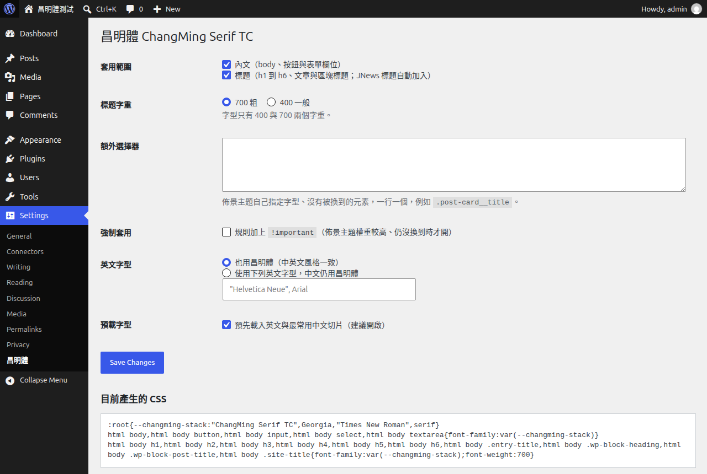
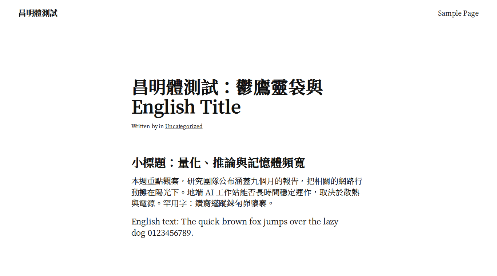

# 昌明體 ChangMing Serif TC

給繁體中文網站用的人文風格明體字 webfont 網頁字型，附 WordPress 外掛，亦提供標準字型檔下載給電腦使用。

昌明體以思源明體（Noto Serif TC）為骨架，主要設計概念是調整了這些元素：
- **收斂三角襯線**：襯線不再那麼銳利。
- **圓潤筆畫轉折**：字從「出版明體」往「人文書體」靠。
- **降低橫豎粗細對比**：版面讀起來更均衡、更現代。


## 特色

- **兩個字重**：400 與 700，同時讓中文、英文、數字風格一致。
- **支援台語、客語用字**：涵蓋教育部台灣閩南語(台語)、台灣客語辭典的用字與台羅、白話字調號，詳見下方說明。
- **依常用字頻切片**：字型切成 unicode-range 分片，瀏覽器只下載頁面實際用到的字。最常用的字與英文會預載，罕用字則會各自落在小分片中。
- **WordPress 外掛**：後台可調整套用範圍、標題字重、額外選擇器、英文字型與預載。偵測到 Elementor 時會自動處理它們的標題與全域字型。
- **自架字型**：除了使用WordPress 外掛，也可以自己下載 zip 部署到網站上，本專案可讓網站不依賴第三方字型服務，本字型檔名帶內容雜湊，可以放心設定長期快取。

## 下載版本

[Releases](https://github.com/ivanusto/changming-serif-tc/releases) 提供四種檔案：

| 檔案 | 適用情境 |
|---|---|
| `changming-webfont-<版本>.zip` | WordPress 網站，安裝後在後台設定 |
| `changming-serif-tc-<版本>-webfont.zip` | 其他網站使用，**建議選這個**；分片載入，只下載頁面用到的字 |
| `changming-serif-tc-<版本>-ttf.zip` | 安裝到電腦，在文書、設計軟體或 App 中使用 |
| `changming-serif-tc-<版本>-woff2.zip` | 完整單檔 WOFF2，瀏覽器會整檔下載，適合 App 內嵌或自行子集化 |

**網頁字型包的用法**：把 `changming/` 資料夾放上網站，在 `<head>` 加入兩行，再指定字型即可。

```html
<link rel="stylesheet" href="/assets/changming/changming.css">
<link rel="stylesheet" href="/assets/changming/changming-tail.css" media="print" onload="this.media='all'">
<style>body { font-family: "ChangMing Serif TC", Georgia, serif; }</style>
```

預載設定與注意事項寫在字型包內的 `README.txt`，也可以直接參考 `example.html`。

## WordPress 外掛安裝

1. 到 [Releases](https://github.com/ivanusto/changming-serif-tc/releases) 下載 `changming-webfont-<版本>.zip`。
2. WordPress 後台進入「外掛」、「安裝外掛」、「上傳外掛」，選擇 zip 並啟用。
   - zip 約 17 MB，主機的 PHP 上傳上限（`upload_max_filesize`）要足夠。
   - 若上限不夠，也可以解壓後用 SFTP 放到 `wp-content/plugins/`。
3. 到「設定」、「昌明體」確認套用範圍。
4. 網站若有頁面快取或 CDN，清除 HTML 快取即可。字型檔網址帶雜湊，不必清除。



## 設定說明

| 選項 | 預設 | 說明 |
|---|---|---|
| 套用範圍 | 內文、標題 | 標題包含 h1 到 h6、文章標題、區塊標題與網站名稱 |
| 標題字重 | 700 | 可改為 400，讓標題較輕 |
| 額外選擇器 | 空 | 佈景主題自行指定字型、沒被換到的元素，一行一個 |
| 強制套用 | 關 | 規則加上 `!important`，佈景主題權重較高時使用 |
| 英文字型 | 昌明體 | 可改用自訂英文字型堆疊，中文仍用昌明體 |
| 預載字型 | 開 | 預載英文與最常用中文分片 |

**調整建議**
- 先用預設值啟用。
- 若有標題沒換到，用瀏覽器「檢查元素」找出它的 class，填進「額外選擇器」。
- 仍無效時，再打開「強制套用」。



## 檔案大小

| 項目 | 大小 |
|---|---|
| 每個字重 | 101 個分片，共約 8.3 到 8.8 MB（瀏覽器只下載用到的分片） |
| 預載分片（英文加最常用中文） | 約 300 KB |
| 一般中文文章的首次造訪 | 400 字重約 1 MB，700 字重約 0.7 MB，之後瀏覽其他頁面幾乎不必再下載 |
| 阻塞渲染的 CSS | brotli 壓縮後約 9 KB；罕用字的宣告另以非阻塞方式載入 |

把標題字重設為 400，可以減少 700 字重分片的下載。

## 台語、客語用字

字表 `data/taigi-hakka.json` 由 `tools/charset.py` 從兩份教育部辭典的開放資料產生：
- 《臺灣台語常用詞辭典》（ChhoeTaigi 整理版與 g0v moedict-data-twblg）：漢字 4,785 字，以及台羅、白話字用到的字母與調號。辭典原始資料以造字區存放的字（例如 𪜶、𬦰、𫝛），依 g0v 的造字對照表轉為正式 Unicode。
- 《臺灣客家語常用詞辭典》（g0v moedict-data-hakka）：漢字 4,899 字，以及客語拼音的上標聲調數字。
- 另含注音符號與方音符號。

Noto Serif TC 缺少的字，依序從下列來源取原始字形，再和其他字一樣經過相同的形態學處理，因此筆畫風格一致：
1. **Noto Serif CJK TC 2.003**：思源宋體的完整字集，共有字的輪廓與 Noto Serif TC 逐點相同，補入 136 字。
2. **源樣明體 GenYo Min 2 TW v2.100**：以思源宋體 V2 為基礎、補齊台客語字的 OFL 字型，字重 L 與 SB 的筆畫粗細與 300、600 相同，補入 86 字（含 ̂ ̋ ̍ ͘ 等調號）。

每個碼位只取一個來源，既有字形不會被取代。逐字來源記錄在建置輸出的 `build/supplement-400.json` 與 `supplement-700.json`。

**目前仍缺的 23 個碼位**
- 17 個 Ext B 漢字：只出現在台語辭典的「異用字」欄，推薦用字都已涵蓋。
- ⁵（U+2075）與 ̤（U+0324）：三個來源都沒有。瀏覽器會由下一個後備字型顯示。
- ㆼ ㆽ ㆾ ㆿ：Unicode 13 新增的方音符號，三個來源都沒有。

## 字頻來源

分片順序依據網路上公開的繁體中文新聞網站文章統計字頻產生，結果存於 `data/charfreq.json`。
- 字頻只影響載入效率，決定哪些字放在前面的分片。
- 字型本身涵蓋完整的常用字與罕用字，任何題材的網站都能正常顯示。
- 可以用 `tools/charfreq.py` 統計自己網站的字頻（讀取 WordPress 公開 REST API），再重新建置。

## 自行建置

需求：docker、curl、sha256sum、unzip。

```sh
./build.sh 1.1.0                 # 完整建置，含約 10 分鐘的字形檢查
SKIP_QA=1 ./build.sh 1.1.0       # 略過字形檢查
MORPH_PROCS=8 ./build.sh 1.1.0   # 限制形態學處理的平行數，記憶體較少時使用
```

**流程**
1. 下載 Noto Serif TC 可變字型（google/fonts 固定 commit）、Noto Serif CJK 2.003 與源樣明體 v2.100，並驗證 sha256。
2. 以字重 300（內文）與 600（粗體）實例化。
3. `tools/merge_supplement.py` 補入台語、客語缺字。
4. `tools/morph.py` 對每個字形做形態學處理：
   - 開運算：半徑 10，收斂襯線與尖角。
   - 閉運算：半徑 12 或 14，圓潤內側轉角。
   - 整體加粗：7 或 12 單位，降低對比。
4. `tools/qa.py` 以格點取樣逐字檢查，確認沒有筆畫流失或填滿，有問題即中止建置。
5. `tools/build.py` 依字頻切片、產生 CSS 與外掛 zip，輸出在 `build/`。

**實測效果**（以「一」與「丨」量測豎橫筆畫比）

| 字重 | 思源明體 | 昌明體 |
|---|---|---|
| 400 | 2.06 | 1.52 |
| 700 | 3.94 | 2.21 |

## 測試

```sh
tests/setup_wp.sh                                   # 以 docker 起本機 WordPress 並建立測試文章
tests/wp_tests.sh "$PWD/build/changming-webfont-1.1.0.zip"  # 20 項外掛功能測試，zip 要給絕對路徑
```

測試涵蓋以下項目，最後會把外掛解除安裝。
- 預設輸出（preload、字型 CSS、非阻塞尾端 CSS、套用規則）
- 各設定的產出
- 設定欄位的 CSS 注入防護
- 設定頁權限
- 停用與解除安裝時移除設定

## 授權

- **字型**（`fonts/`、外掛內的字型檔）：[SIL Open Font License 1.1](fonts/OFL.txt)。
  - 昌明體修改自 Noto Serif TC，(c) 2017-2024 Adobe。Noto 是 Google 的商標。
  - 字型名稱不使用原字型名稱，不單獨販售。
- **程式碼**（外掛與建置工具）：[GPL-2.0-or-later](LICENSE)。

## 作者

ivanusto，[yblog.org](https://yblog.org)
